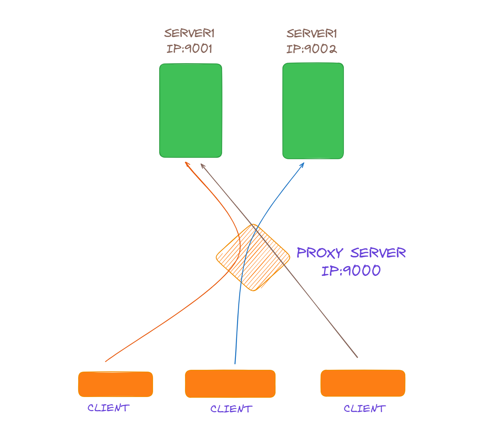

## A Simple HTTP Load Balancer

A load balancer acts as the traffic cop setting in front of servers and routing client requests across all servers.

Here a simple **Load Balancer** like is implemented with HTTP Proxy. There are two server running on two different ports and the proxy server is the main server which is bind with Domain Name which will route the request from the client to the server available.

## PROXY

We can use **HTTP PROXY** which here acts as a **Load Balancer** where each client will request with a Domain Name of the server. We can also **Interrupt** any restricted client IP or modify request Headers before forwarding to the server.

This PROXY will get a request from a client, forward request to any available server and respond the response to the client.

There are many algorithms by which we can route the request to available servers.

Using a PROXY is a very important thing to do while deploying web servers.
